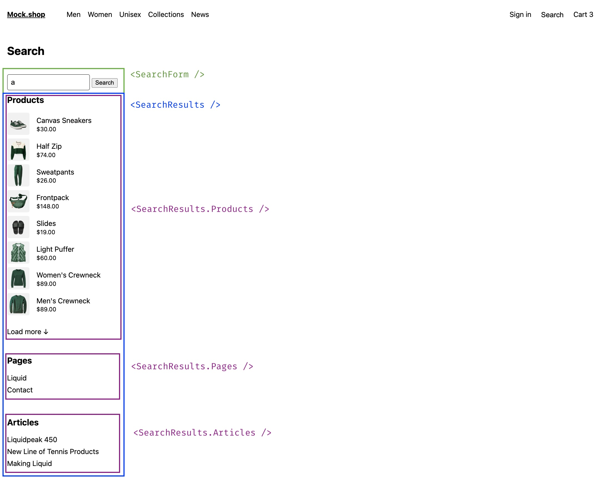

# Hydrogen Search

Our skeleton template ships with a `/search` route and a set of components to easily
implement a traditional search flow.

This integration uses the storefront API (SFAPI) [search](https://shopify.dev/docs/api/storefront/latest/queries/search)
endpoint to retrieve search results based on a search term.

## Components Architecture



## Components

| File                                                                   | Description                                                                                                                 |
| ---------------------------------------------------------------------- | --------------------------------------------------------------------------------------------------------------------------- |
| [`app/components/SearchForm.tsx`](app/components/SearchForm.tsx)       | A fully customizable form component configured to make (server-side) form `GET` requests to the `/search` route.            |
| [`app/components/SearchResults.tsx`](app/components/SearchResults.tsx) | A fully customizable search results wrapper, that provides compound components to render `articles`, `pages` and `products` |

## Instructions

### 1. Create the search route

Create a new file at `/routes/search.tsx`

### 3. Add `search` query and fetcher

The search fetcher parses the `q` parameter and performs the search SFAPI request.

```ts
/**
 * Regular search query and fragments
 * (adjust as needed)
 */
const SEARCH_PRODUCT_FRAGMENT = `#graphql
  fragment SearchProduct on Product {
    __typename
    handle
    id
    publishedAt
    title
    trackingParameters
    vendor
    selectedOrFirstAvailableVariant(
      selectedOptions: []
      ignoreUnknownOptions: true
      caseInsensitiveMatch: true
    ) {
      id
      image {
        url
        altText
        width
        height
      }
      price {
        amount
        currencyCode
      }
      compareAtPrice {
        amount
        currencyCode
      }
      selectedOptions {
        name
        value
      }
      product {
        handle
        title
      }
    }
  }
` as const

const SEARCH_PAGE_FRAGMENT = `#graphql
  fragment SearchPage on Page {
     __typename
     handle
    id
    title
    trackingParameters
  }
` as const

const SEARCH_ARTICLE_FRAGMENT = `#graphql
  fragment SearchArticle on Article {
    __typename
    handle
    id
    title
    trackingParameters
  }
` as const

const PAGE_INFO_FRAGMENT = `#graphql
  fragment PageInfoFragment on PageInfo {
    hasNextPage
    hasPreviousPage
    startCursor
    endCursor
  }
` as const

// NOTE: https://shopify.dev/docs/api/storefront/latest/queries/search
export const SEARCH_QUERY = `#graphql
  query Search(
    $country: CountryCode
    $endCursor: String
    $first: Int
    $language: LanguageCode
    $last: Int
    $term: String!
    $startCursor: String
  ) @inContext(country: $country, language: $language) {
    articles: search(
      query: $term,
      types: [ARTICLE],
      first: $first,
    ) {
      nodes {
        ...on Article {
          ...SearchArticle
        }
      }
    }
    pages: search(
      query: $term,
      types: [PAGE],
      first: $first,
    ) {
      nodes {
        ...on Page {
          ...SearchPage
        }
      }
    }
    products: search(
      after: $endCursor,
      before: $startCursor,
      first: $first,
      last: $last,
      query: $term,
      sortKey: RELEVANCE,
      types: [PRODUCT],
      unavailableProducts: HIDE,
    ) {
      nodes {
        ...on Product {
          ...SearchProduct
        }
      }
      pageInfo {
        ...PageInfoFragment
      }
    }
  }
  ${SEARCH_PRODUCT_FRAGMENT}
  ${SEARCH_PAGE_FRAGMENT}
  ${SEARCH_ARTICLE_FRAGMENT}
  ${PAGE_INFO_FRAGMENT}
` as const

/**
 * Regular search fetcher
 */
async function search({
  request,
  context,
}: Pick<LoaderFunctionArgs, 'request' | 'context'>) {
  const { storefront } = context
  const url = new URL(request.url)
  const searchParams = new URLSearchParams(url.search)
  const variables = getPaginationVariables(request, { pageBy: 8 })
  const term = String(searchParams.get('q') || '')

  // Search articles, pages, and products for the `q` term
  const { errors, ...items } = await storefront.query(SEARCH_QUERY, {
    variables: { ...variables, term },
  })

  if (!items) {
    throw new Error('No search data returned from Shopify API')
  }

  if (errors) {
    throw new Error(errors[0].message)
  }

  const total = Object.values(items).reduce((acc, { nodes }) => {
    return acc + nodes.length
  }, 0)

  return { term, result: { total, items } }
}
```

### 3. Add a `loader` export to the route

This loader receives and processes `GET` requests from the `<SearchForm />` component.

A `q` URL parameter will be used as the search term and appended automatically by
the form if present in it's children prop

```ts
/**
 * Handles regular search GET requests
 * requested by the SearchForm component and /search route visits
 */
export async function loader({ request, context }: LoaderFunctionArgs) {
  const url = new URL(request.url)
  const isRegular = !url.searchParams.has('predictive')

  if (!isRegular) {
    return {}
  }

  const searchPromise = regularSearch({ request, context })

  searchPromise.catch((error: Error) => {
    console.error(error)
    return { term: '', result: null, error: error.message }
  })

  return await searchPromise
}
```

### 4. Render the search form and results

Finally, create a default export to render both the search form and the search results

```ts
import {SearchForm} from '~/components/SearchForm';
import {SearchResults} from '~/components/SearchResults';

/**
 * Renders the /search route
 */
export default function SearchPage() {
  const {term, result} = useLoaderData<typeof loader>();

  return (
    <div className="search">
      <h1>Search</h1>
      <SearchForm>
        {({inputRef}) => (
          <>
            <input
              defaultValue={term}
              name="q"
              placeholder="Search…"
              ref={inputRef}
              type="search"
            />
            &nbsp;
            <button type="submit">Search</button>
          </>
        )}
      </SearchForm>
      {!term || !result?.total ? (
        <SearchResults.Empty />
      ) : (
        <SearchResults result={result} term={term}>
          {({articles, pages, products, term}) => (
            <div>
              <SearchResults.Products products={products} term={term} />
              <SearchResults.Pages pages={pages} term={term} />
              <SearchResults.Articles articles={articles} term={term} />
            </div>
          )}
        </SearchResults>
      )}
    </div>
  );
}
```

## Additional Notes

### How to use a different URL search parameter?

- Modify the `name` attribute in the forms input element. e.g

```ts
<input name="query" />`.
```

- Modify the search fetcher term variable to parse the new name. e.g

```ts
const term = String(searchParams.get('query') || '')
```

### How to customize the way the results look?

Simply go to `/app/components/SearchResults.txx` and look for the compound component you
want to modify.

For example, let's render articles in a horizontal flex container

```diff
SearchResults.Pages = function({
  pages,
  term,
}: {
  pages: SearchItems['pages'];
  term: string;
}) {
  if (!pages?.nodes.length) {
    return null;
  }
  return (
    <div className="search-result">
      <h2>Pages</h2>
+     <div className="flex">
        {pages?.nodes?.map((page) => {
          const pageUrl = urlWithTrackingParams({
            baseUrl: `/pages/${page.handle}`,
            trackingParams: page.trackingParameters,
            term,
          });
          return (
            <div className="search-results-item" key={page.id}>
              <Link prefetch="intent" to={pageUrl}>
                {page.title}
              </Link>
            </div>
          );
        })}
      </div>
    </div>
  );
};
```
